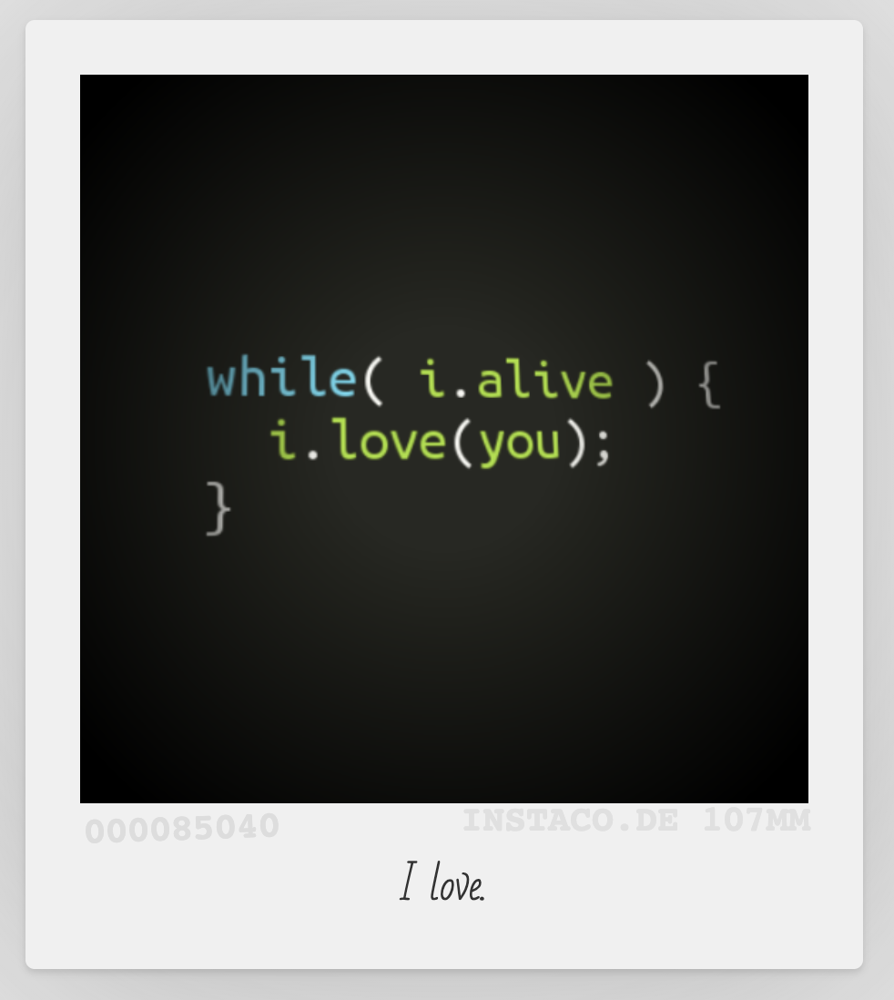
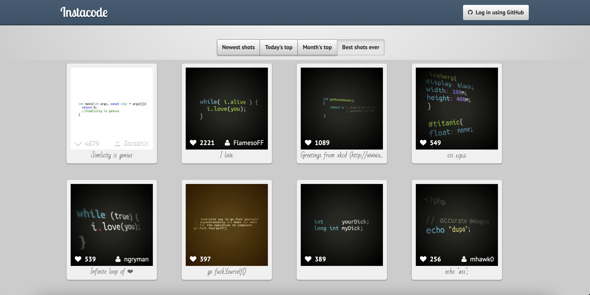
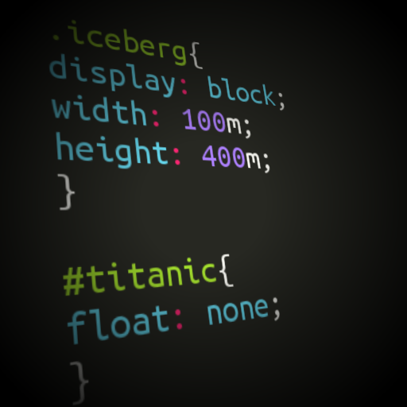
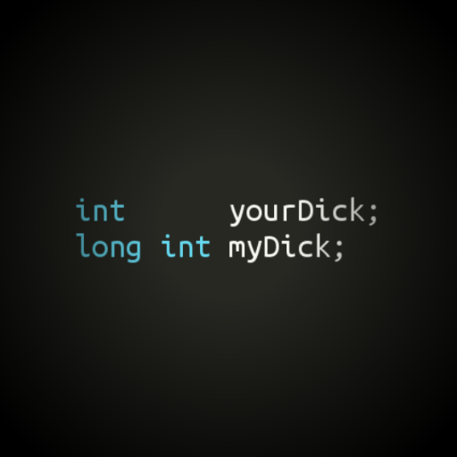
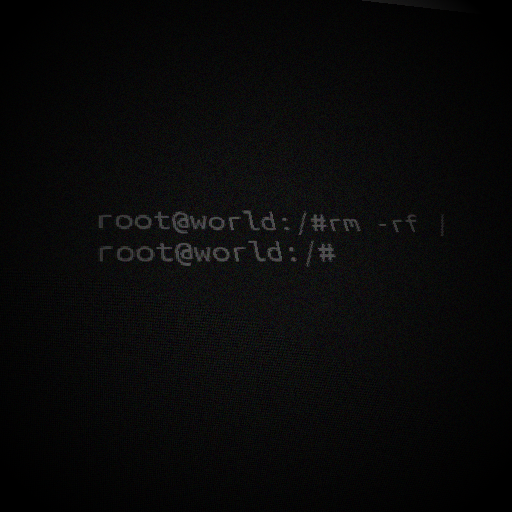
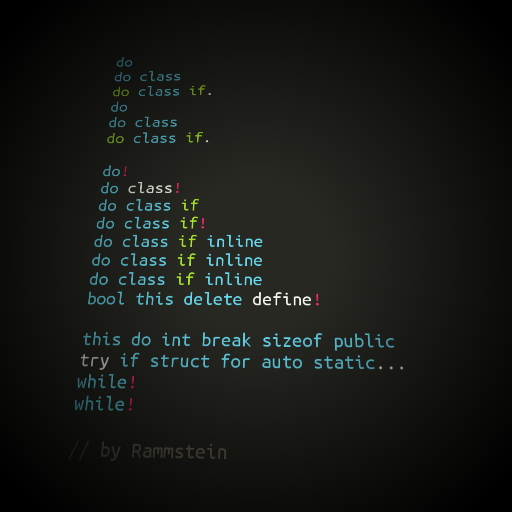
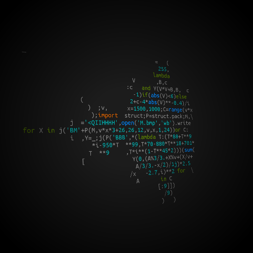
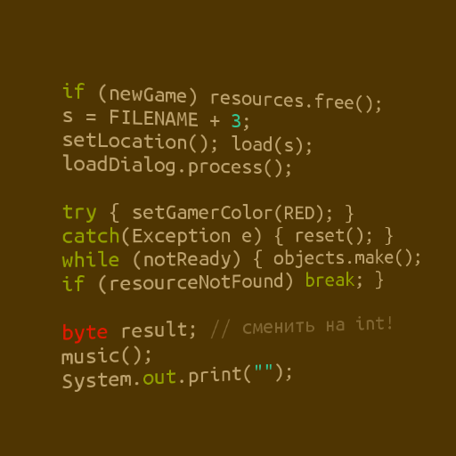

# Instacode

Instacode was a service that allowed users to create stylish screenshots of their code snippets and share them.

It came around in 2013 and was shut down in 2021.

These are the top submissions at the time of death:

